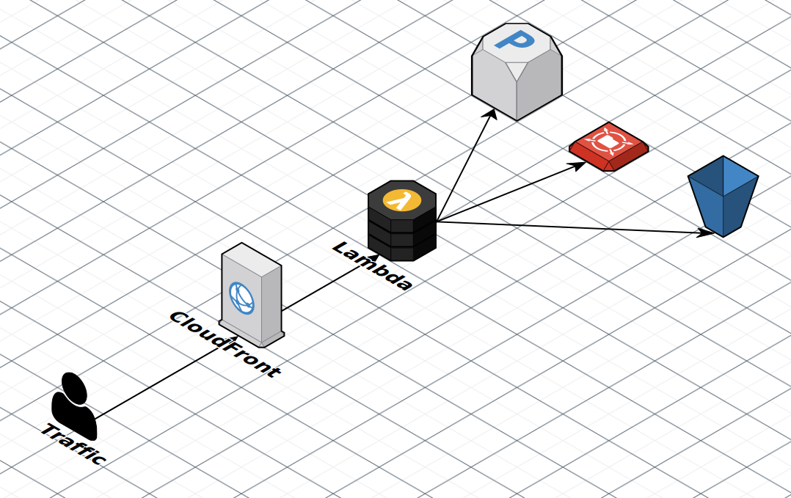

# wordpress-cluster

Run a scalable, stateless cluster of Wordpress sites on AWS

## Initial Setup

1. Create an EFS
2. `ssh` into a new or existing instance (EC-2, Kubernetes node, etc) and mount the EFS.

```
$ sudo mount -t nfs -o nfsvers=4.1,rsize=1048576,wsize=1048576,hard,timeo=600,retrans=2,noresvport {EFS dns name}:/  /mnt/efs
```

3. Use SFTP or wp-cli to set up your wordpress websites inside of the EFS.
4. Create a MySQL compatible database and set up your database(s). (RDS, PlanetScale, etc)

## Lambda

Use a php runtime layer on AWS Lambda to run Wordpress. Wordpress root is persisted through EFS.

### Structure



#### Cloudfront

The entry point of any user request will be to a CloudFront distribution. The distribution origin points to the Lambda function URL. The website domain and certificate should CNAME to the distribution.

#### Lambda

The serverless.yml should allow for easy deployment of a lambda function. Once the function is created, use the function's url to set up your CloudFront distribution.

The Lambda function uses a custom layer from the serverless PHP runtime, Bref.

- [Bref Documentation](https://bref.sh/docs)
- [Bref runtimes](https://runtimes.bref.sh/)

An EFS access point must be attached to the function, and for this your Lambda function will need to be in a VPC. Which also most likely means you will need a NAT Gateway in your VPC to access the internet.

## Kubernetes

Use Kubernetes as a container platform to run tiny stateless instances of Wordpress. Each container uses EFS for file storage, and RDS for database storage.

### Structure

This setup is intended for running multiple separate Wordpress websites. A lot of setups I see are for setting up a cluster for running only one website.


#### Cloudfront

The entry point of any user request will be to a CloudFront distribution. The distribution should be tied to the main domain name using CNAMEs as well as have a valid SSL cert attached (ACM). For each different Wordpress you have, set up a distribution. All of the distributions will route to the single ELB instance. The traffic to the ELB is done over SSL, so make sure you have a certificate attached to your ELB, and that the cloudfront distributions point to that domain name.

#### LoadBalancer

The Kubernetes cluster has one main LoadBalancer in the form of an ELB. Each request coming into the ELB will be passed to the individual nodes.

#### Proxy

All requests from the ELB are sent into an nginx proxy deployment which will route the request to the appropriate Wordpress deployment usually based on the hostname of the request.

#### Container

Each Wordpress site is served by one or more containers. Each container is a basic Alpine linux image with php7, php-fpm, and nginx. The containers will volume mount to EFS at the specified location where its Wordpress root is.

### Setup

1. Setup your Kubernetes cluster using KOPS
2. Ensure Wordpress sites are in your EFS. This repo uses `/wordpress/<example.com>/` as its structure for each website.

```
/
└── wordpress
    └──  example.com
         ├── logs
         ├── sessions
         ├── wordpress # Wordpress root
         └── wp-config.php
```

**Note:** Containers will volume mount `/wordpress/mywebsite` from the EFS to `/app`

5. Deploy `proxy-deployment.yml` to set up your nginx proxy and ELB.
6. Set up each deployment using `wordpress-deployment.yml` as a template. Deploy as many for as many sites as you want.
